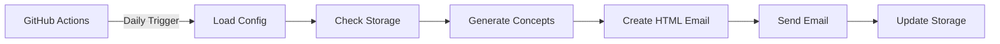

# 🤖 AI Insight Daily: 5 Concepts, 5 Minutes

An automated daily AI learning system that sends beautiful HTML emails with 5 new AI concepts every day, avoiding duplicates and tracking learning progress.

Created and maintained by Moussaab Boutelis.


## ✨ Features

✅ **Daily AI Concepts** - Receive 5 new AI concepts every day  
✅ **No Duplicates** - Smart tracking system avoids repeating topics  
✅ **Beautiful Emails** - Responsive HTML design optimized for readability  
✅ **100% Free** - Runs on GitHub Actions completely free  
✅ **Zero Maintenance** - Set it up once, runs forever  
✅ **Modular Design** - Clean, maintainable code structure  

## 📸 Preview

Your daily email will look like this:

```
🤖 AI Insight Daily
5 Concepts, 5 Minutes
📅 October 25, 2025

Hello AI Learner! 👋
Here are your 5 new AI concepts for today...

1. Transfer Learning
   Definition, applications, and examples...

2. Attention Mechanisms
   How they work, use cases...

[... 3 more concepts]

Keep learning, keep growing! 🚀
```

## 📁 Project Structure

```
ai-insight-daily/
├── .github/
│   └── workflows/
│       └── daily_ai_email.yml    # GitHub Actions automation
├── src/
│   ├── __init__.py              # Package initialization
│   ├── main.py                  # Main orchestrator
│   ├── config.py                # Configuration management
│   ├── storage.py               # Concept tracking storage
│   ├── ai_generator.py          # Perplexity API integration
│   ├── email_template.py        # HTML email templates
│   └── email_sender.py          # SMTP email sending
├── data/
│   ├── .gitkeep                 # Keeps directory in git
│   └── sent_concepts.json       # Tracks sent concepts (auto-generated)
├── tests/
│   ├── test_all.py              # Unit tests
│   └── README.md                # Test documentation
├── .env.example                 # Environment variables template
├── .gitignore                   # Git ignore rules
├── LICENSE                      # MIT License
├── README.md                    # This file
├── SETUP_GUIDE.md              # Complete setup instructions
└── requirements.txt             # Python dependencies
```

## 🚀 Quick Start

### Prerequisites

- GitHub account (free)
- Gmail account (for sending emails)
- Perplexity API key ([Get it free](https://www.perplexity.ai/))

### Setup in 5 Minutes

1. **Clone this repository**
   ```bash
   git clone https://github.com/yourusername/ai-insight-daily.git
   cd ai-insight-daily
   ```

2. **Get your API credentials** (follow [SETUP_GUIDE.md](SETUP_GUIDE.md))
   - Perplexity API Key
   - Gmail App Password

3. **Configure GitHub Secrets**
   - Go to: Repository → Settings → Secrets → Actions
   - Add: `PERPLEXITY_API_KEY`, `FROM_EMAIL`, `TO_EMAIL`, `APP_PASSWORD`

4. **Enable GitHub Actions**
   - Go to Actions tab
   - Enable workflows

5. **Test it!**
   - Actions → Daily AI Concepts Email → Run workflow

📖 **Detailed setup:** See [SETUP_GUIDE.md](SETUP_GUIDE.md) for complete step-by-step instructions.

## 🧪 Local Testing

```powershell
# 1. Create virtual environment
python -m venv venv
.\venv\Scripts\Activate.ps1  # Windows PowerShell

# 2. Install dependencies
pip install -r requirements.txt

# 3. Copy and configure environment
copy .env.example .env
notepad .env  # Fill in your credentials

# 4. Run the script
cd src
python main.py
```

## 🔧 Configuration

### Change Email Schedule

Edit `.github/workflows/daily_ai_email.yml`:
```yaml
schedule:
  - cron: '0 8 * * *'  # Daily at 8:00 AM UTC
```

[Cron expression generator](https://crontab.guru/)

### Customize Email Design

Edit `src/email_template.py`:
- Modify colors, fonts, spacing
- Add your branding or logo
- Change layout structure

### Change AI Model

Edit `src/config.py`:
```python
self.model_name = "sonar"  # Or "sonar-pro", etc.
```

## 📊 How It Works



1. **GitHub Actions** triggers daily at scheduled time
2. **Config** validates all environment variables
3. **Storage** loads previously sent topics (avoid duplicates)
4. **AI Generator** calls Perplexity API for new concepts
5. **Email Template** creates beautiful HTML email
6. **Email Sender** sends via Gmail SMTP
7. **Storage** updates with new concepts for future tracking

## 🧩 Module Details

### `main.py`
- Orchestrates the entire workflow
- Handles errors gracefully
- Provides progress feedback

### `config.py`
- Manages environment variables
- Validates required settings
- Provides sensible defaults

### `storage.py`
- Tracks sent concepts in JSON
- Prevents duplicate topics
- Maintains rolling history (last 100 concepts)

### `ai_generator.py`
- Integrates with Perplexity API
- Generates 5 new concepts
- Extracts concept titles for tracking

### `email_template.py`
- Creates responsive HTML emails
- Beautiful gradient design
- Mobile-friendly layout

### `email_sender.py`
- Sends emails via Gmail SMTP
- Handles authentication securely
- Supports HTML content

## 🔒 Security

- ✅ All credentials stored as GitHub Secrets
- ✅ No credentials in code or git history
- ✅ `.env` file excluded via `.gitignore`
- ✅ SMTP uses SSL/TLS encryption

## 🧪 Testing

Run unit tests:
```bash
# Using unittest
python -m unittest discover tests

# Using pytest (install: pip install pytest)
pytest tests/ -v
```

## 🐛 Troubleshooting

### Email not received?
- Check spam/junk folder
- Verify Gmail App Password is correct
- Ensure 2-Step Verification is enabled

### API errors?
- Verify Perplexity API key
- Check API quota/limits
- Review workflow logs

### Workflow not running?
- Check Actions are enabled
- Verify secrets are set correctly
- Check workflow YAML syntax

**More help:** See [SETUP_GUIDE.md](SETUP_GUIDE.md#-troubleshooting)

## 💰 Cost

**Total: $0/month** (using free tiers)

- GitHub Actions: 2,000 minutes/month free
- Perplexity API: Free tier available
- Gmail SMTP: Free
- This workflow: ~1 minute/day = 30 minutes/month

## 🎯 Roadmap

- [ ] Add support for multiple languages
- [ ] Include images/diagrams in emails
- [ ] Weekly summary option
- [ ] Difficulty level customization
- [ ] Integration with Notion/Obsidian
- [ ] Mobile app notifications

## 🤝 Contributing

Contributions are welcome!

1. Fork the repository
2. Create a feature branch (`git checkout -b feature/amazing-feature`)
3. Commit your changes (`git commit -m 'Add amazing feature'`)
4. Push to the branch (`git push origin feature/amazing-feature`)
5. Open a Pull Request

## 📄 License

This project is licensed under the MIT License - see the [LICENSE](LICENSE) file for details.

## 🙏 Acknowledgments

- Moussaab Boutelis for creating and maintaining AI Insight Daily
- [Perplexity AI](https://www.perplexity.ai/) for the amazing AI API
- [GitHub Actions](https://github.com/features/actions) for free automation
- All contributors who help improve this project

## 📧 Contact

Questions or suggestions? Open an issue or reach out!

- Connect on LinkedIn: https://www.linkedin.com/in/boutelis-moussaab/

---

**Made with ❤️ for AI learners everywhere**

⭐ **Star this repo if you find it useful!**


## 🐛 Troubleshooting

### Email not received?
- Check spam/junk folder
- Verify Gmail App Password is correct
- Ensure 2-Step Verification is enabled

### API errors?
- Verify Perplexity API key
- Check API quota/limits
- Review workflow logs

### Workflow not running?
- Check Actions are enabled
- Verify secrets are set correctly
- Check workflow YAML syntax

**More help:** See [SETUP_GUIDE.md](SETUP_GUIDE.md#-troubleshooting)

## 💰 Cost

**Total: $0/month** (using free tiers)

- GitHub Actions: 2,000 minutes/month free
- Perplexity API: Free tier available
- Gmail SMTP: Free
- This workflow: ~1 minute/day = 30 minutes/month

## 🎯 Roadmap

- [ ] Add support for multiple languages
- [ ] Include images/diagrams in emails
- [ ] Weekly summary option
- [ ] Difficulty level customization
- [ ] Integration with Notion/Obsidian
- [ ] Mobile app notifications

## 🤝 Contributing

Contributions are welcome!

## Contributing

Contributions welcome! Please open an issue or submit a pull request.

